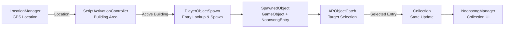

# ❄️ Friends! Noonsong

> GPS 기반 AR 수집 게임  


GPS를 기반으로 캠퍼스 내 건물 영역을 탐험하며,
건물별로 나타나는 AR 캐릭터(학과별 마스코트)를 수집하여 도감을 완성하는 모바일 게임입니다.

| | |
|---|---|
| Platform | iOS / Android |
| Engine | Unity 2022.3.10f1 |
| Tech | C#, AR Foundation |
| Role | Client Developer |
| Team | 17 members / Client 3 |
| Period | 2024.08 - 2025.05 |

> This repository is a fork of a team project.  
> The sections below focus on the systems I directly implemented or refactored.

---
## My Contribution

- **AR Target Selection**  
  화면 내 AR Object의 존재 여부를 판정하고 현재 상호작용 대상을 관리하는 시스템 구현

- **Location-based Entry Lookup**  
  건물별 Spawn 후보 데이터를 조회하는 구조를 구현하고 Dictionary 기반 Cache로 리팩토링

- **Runtime Data Mapping**
  Spawn된 `GameObject`와 `NoonsongEntry`를 연결하여 Collection까지 동일한 Entry reference 유지

- **Runtime Optimization**  
  AR Target 탐지 과정의 반복 Allocation을 줄이고 실행 빈도를 제어하여 Runtime Cost 개선

## System Architecture

GPS 위치 정보부터 AR Object Spawn, Target Selection, Collection UI까지
다음과 같은 흐름으로 연결됩니다.



`NoonsongEntry`를 캐릭터 데이터의 기준으로 사용하고,
Spawn 시 Runtime `GameObject`와 함께 `SpawnedObject`로 연결합니다.

```csharp
public class SpawnedObject
{
    public GameObject GameObject { get; private set; }
    public NoonsongEntry NoonsongEntry { get; private set; }

    public SpawnedObject(GameObject gameObject, NoonsongEntry noonsongEntry)
    {
        GameObject = gameObject;
        NoonsongEntry = noonsongEntry;
    }
}
```
---

## Core Components

### 01. Location-based Entry Lookup

현재 활성화된 건물을 기준으로 해당 위치에서 Spawn 가능한
`NoonsongEntry` 후보군을 결정합니다.

#### Building Entry Cache

기존에는 Spawn 후보를 조회할 때마다 **전체** `NoonsongEntry`를 순회하여
`buildingName`이 일치하는 Entry를 새로운 List에 추가했습니다.

```csharp
// Before
List<NoonsongEntry> filteredEntries = new List<NoonsongEntry>();

foreach (var entry in entries)
{
    if (entry.buildingName == buildingName)
    {
        filteredEntries.Add(entry);
    }
}
```

이를 **초기화** 시점에 **건물 이름으로 분류하여 캐싱**하도록 변경했습니다.

```csharp
private Dictionary<string, List<NoonsongEntry>> entriesByBuilding;

private void BuildEntryCache()
{
    allEntriesCache = noonsongEntryManager.GetNoonsongEntries();
    entriesByBuilding = new Dictionary<string, List<NoonsongEntry>>();

    foreach (var entry in allEntriesCache)
    {
        if (entry == null || string.IsNullOrEmpty(entry.buildingName))
            continue;

        if (!entriesByBuilding.TryGetValue(entry.buildingName, out var list))
        {
            list = new List<NoonsongEntry>();
            entriesByBuilding[entry.buildingName] = list;
        }

        list.Add(entry);
    }
}
```
| | Before | After |
|---|---|---|
| Entry Lookup | 전체 Entry 순회 | Dictionary Lookup |
| Complexity | `O(N)` | Average `O(1)` |
| Temporary List | 조회마다 생성 | Cached List 재사용 |

이후 Spawn 시에는 현재 건물의 `buildingName`을 key로
해당 후보 List를 바로 조회합니다.

```csharp
private List<NoonsongEntry> GetNoonsongEntriesByBuildingName(string buildingName)
{
    if (entriesByBuilding.TryGetValue(buildingName, out var entries))
    {
        return entries;
    }

    return EmptyEntries;
}
```

### 02. AR Target Selection

화면 중앙 Raycast만으로는 화면 안에 존재하는 AR Object를 안정적으로 판별하기 어려워,
Object의 중심과 상·하·좌·우 지점을 Screen Space로 변환하여 가시성을 판정합니다.

```text
Spawned Objects
      ↓
5-point Visibility Check
      ↓
WorldToScreenPoint
      ↓
Screen Bounds
      ↓
currentTarget
```

```csharp
foreach (Vector3 point in checkPoints)
{
    Vector3 screenPoint = mainCamera.WorldToScreenPoint(point);

    if (screenPoint.z > 0 &&
        screenPoint.x > -screenPadding &&
        screenPoint.x < Screen.width + screenPadding &&
        screenPoint.y > -screenPadding &&
        screenPoint.y < Screen.height + screenPadding)
    {
        return true;
    }
}
```

가시성이 확인된 Runtime Object를 `currentTarget`으로 관리하고,
`SpawnedObject`에 연결된 `NoonsongEntry`를 이후 상호작용 과정에 전달합니다.

**Code:** [`ARObjectCatch.cs`](Assets/Scripts/CollectionScene/ARObjectCatch.cs)
— `UpdateCurrentTarget()`, `IsVisibleInView()`

---

## Runtime Optimization

AR Target 탐지 로직의 반복 실행 비용과 Allocation을 분석하고,
호출 빈도 제어와 데이터 재사용 구조를 적용했습니다.

| | Before | After |
|---|---|---|
| Target Detection | Every Frame | `0.1s` Interval |
| Checkpoint Array | 탐지마다 생성 | Reusable Array |

### Detection Frequency

화면 내 Target 판정은 매 프레임 실행할 필요가 없다고 판단하여
`Update()` 기반 탐지를 약 `0.1s` 간격으로 제한했습니다.

```csharp
// Before
void Update()
{
    CheckForObjectInView();
}

// After
private IEnumerator CheckForObjectInViewCoroutine()
{
    while (true)
    {
        UpdateCurrentTarget();
        yield return detectWait;
    }
}
```

### Allocation Reduction

탐지마다 생성되던 Checkpoint 배열을 재사용하도록 변경하고,
`Camera.main`과 `WaitForSeconds`를 초기화 시 캐싱했습니다.

```csharp
private readonly Vector3[] checkPoints = new Vector3[5];

private void Start()
{
    mainCamera = Camera.main;
    detectWait = new WaitForSeconds(detectInterval);
}
```

**Code:** [`ARObjectCatch.cs`](Assets/Scripts/CollectionScene/ARObjectCatch.cs)

---

## Live Service Experience

2025.05.01 – 2025.05.21 동안 iOS / Android 실제 사용자 환경에서 서비스를 운영하며
GPS, AR Session, 장시간 실행 환경에서 발생하는 이슈를 재현하고 대응했습니다.

- 100건 이상의 사용자 피드백 및 이슈 분석
- GPS / Building Zone Boundary 현장 테스트
- 실제 디바이스 기반 이슈 재현 및 로그 추적
- 수정 → 재현 시나리오 테스트 → 패치 배포

---

## Code Navigation

| Area | Code | Responsibility |
|---|---|---|
| AR Target Selection | [`ARObjectCatch.cs`](Assets/Scripts/CollectionScene/ARObjectCatch.cs) | 화면 내 AR Object 판정 및 Target 관리 |
| Entry Lookup / Spawn | [`PlayerObjectSpawn.cs`](Assets/Scripts/ObjectSpawn/PlayerObjectSpawn.cs) | 건물별 Entry 조회 및 Spawn |
| Runtime Data Mapping | [`SpawnObject.cs`](Assets/Scripts/CollectionScene/SpawnObject.cs) | Runtime GameObject ↔ Entry 연결 |
| Data Model | [`NoonsongEntry.cs`](Assets/Scripts/CollectionScene/NoonsongEntry.cs) | 캐릭터 ScriptableObject 데이터 모델 |

---

## Contribution Scope

> This repository is a fork of a team project.

README에서는 제가 직접 구현하거나 리팩토링한 영역을 중심으로 설명했습니다.

- `ARObjectCatch` — AR Target Selection 및 Runtime Optimization
- `SpawnedObject` — Runtime Object ↔ Entry 연결 구조
- `NoonsongEntry` — 초기 ScriptableObject 데이터 모델 설계
- `PlayerObjectSpawn` — 공동 Spawn 코드 중 Building Entry Cache 및 후보 조회/선택 로직 리팩토링

그 외 시스템은 전체 프로젝트의 데이터 흐름을 설명하기 위한 맥락으로만 포함했습니다.

## Links

- [Project Notion](https://app.notion.com/p/teamnob/95db8411afc147c4b7c93fbaea46fcae?source=copy_link)
